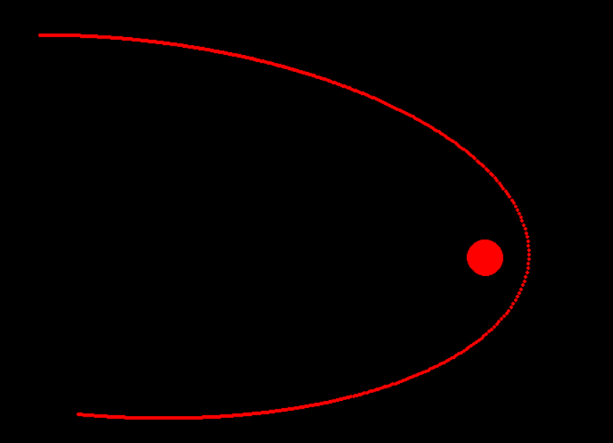

# Creating a physics engine in python-pygame
Just experimenting around with the pygame module from python and trying to build in some basic physics implementations.

# Gravitational Force implementation
The gravitation force was quite easy to do all i had to do was just to tweak some values of the masses of particles and change the value of G (Gravitational Constant) a little bit to get a nice elliptical orbit. Here's an image of how the path of a particle with some initial velocity != 0 is

{:height=200px}

